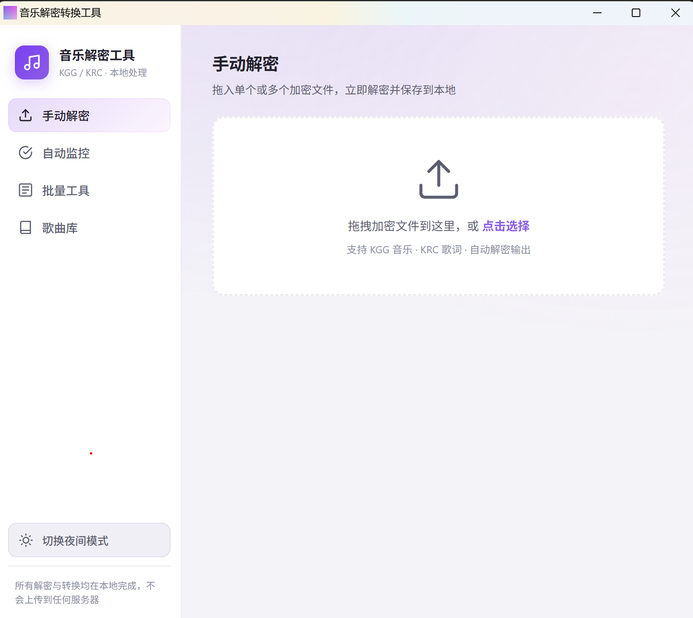
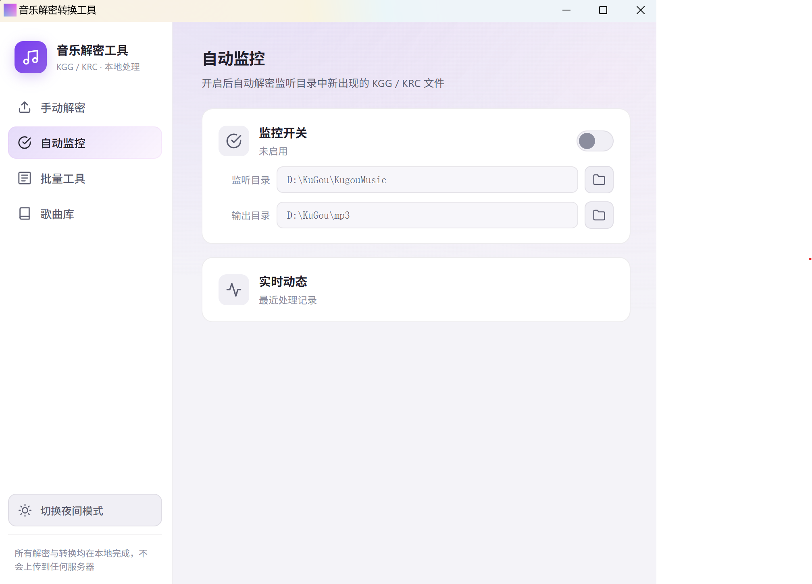
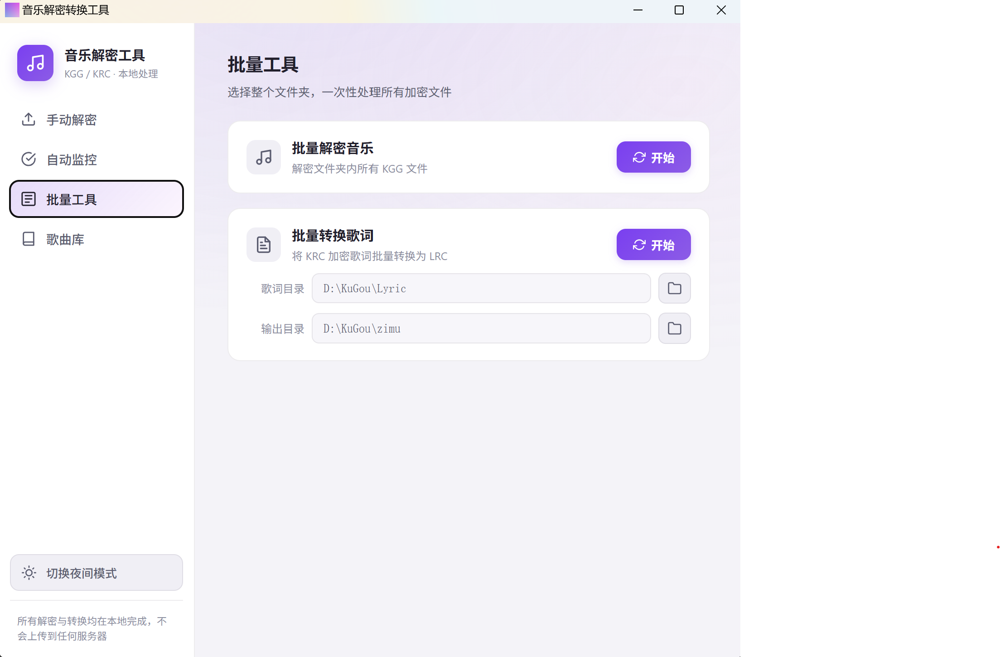
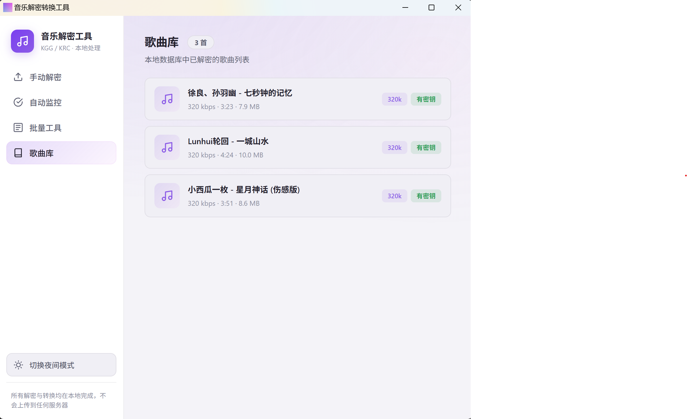
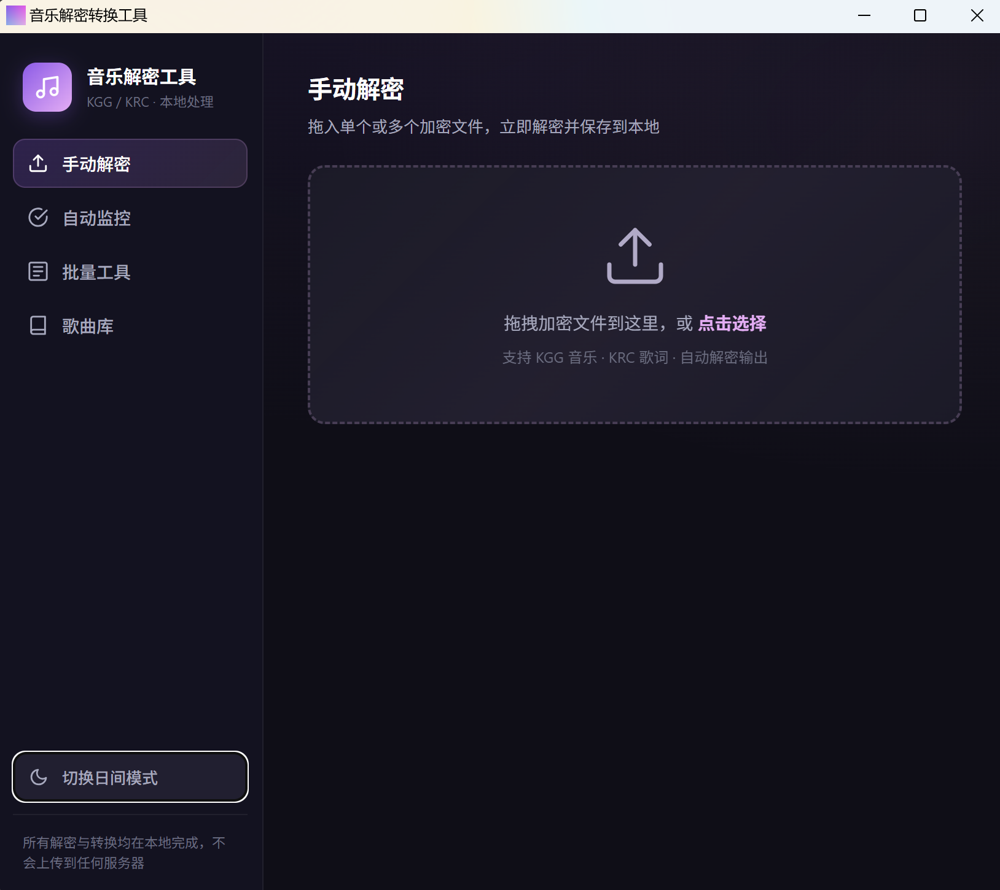

# KGG Decryptor

KGG Decryptor 是一个基于 Tauri 2 的酷狗本地音乐解密转换工具。它可以读取本机酷狗客户端已下载歌曲对应的本地密钥，将 KGG 音乐文件转换为 MP3 / FLAC / OGG，并支持 KRC 加密歌词转换（单个或批量）为标准 LRC。

> 本项目只处理你本机已经具备播放和下载条件的文件，不提供绕过会员、绕过授权或在线破解能力。

## Preview


### 主界面 — 手动解密（日间模式）




### 自动监控




### 批量工具（批量解密 + 歌词转换）




### 歌曲库




### 夜间模式




## Features

应用采用侧边栏导航，分为四个功能页面：

### 🎵 手动解密

- 拖拽或点击选择 KGG / KRC 文件，立即处理。
- KGG 音乐自动识别并输出 MP3 / FLAC / OGG（按文件头判断，保留原始音质）。
- KRC 歌词即时转换为标准 LRC（UTF-8 编码）。
- 单文件处理进度与结果实时显示。

### 👁 自动监控

- 一键开关，监听酷狗下载目录，新文件下载完成后自动解密。
- 监听目录、输出目录可自定义，支持浏览选择，配置自动记忆。
- 实时动态面板展示每个文件的处理状态（检测 / 成功 / 失败）。
- 运行状态在侧边栏显示呼吸指示灯。

### 📦 批量工具

- **批量解密音乐**：选择文件夹，一次性解密其中所有 KGG 文件，报告成功 / 失败数量。
- **批量转换歌词**：选择 KRC 歌词目录，批量转换为标准 LRC，输出目录可自定义。
- KRC 转换不依赖数据库密钥，任何 KRC 文件（`krc1` 魔术头）均可转换。

### 📚 歌曲库

- 自动定位并解密读取酷狗本地数据库 `KGMusicV3.db`。
- 浏览已下载歌曲：歌名、音质、码率、时长、文件大小、密钥状态。

### 🌗 界面

- 日间 / 夜间双主题，一键切换，自动记住选择（默认日间）。
- 所有解密、转换、数据库读取均在本地完成，不上传任何数据。

## Important

KGG 音乐转换依赖酷狗客户端写入本地数据库的解密密钥，因此使用前需要满足以下条件：

1. 你是酷狗会员，且已在酷狗客户端中成功下载过目标歌曲。
2. 酷狗客户端已在本地 `KGMusicV3.db` 数据库中写入该歌曲对应的 `eKey`。
3. 本工具能读取到本机的酷狗数据库和目标 KGG 文件。

简单说：酷狗客户端已经能在本机播放、且已经下载过的歌，本工具才有机会转换；数据库中没有对应密钥的文件无法解密。

KRC 歌词转换不依赖数据库密钥。KRC 文件以 `krc1` 魔术头开头，经过固定 XOR 密钥解密和 zlib 解压后，可转换为 UTF-8 编码的 LRC 文本（逐行时间标签已转换为标准 `[mm:ss.xx]` 格式）。

## How It Works

```text
酷狗客户端下载歌曲
       |
       v
KGG 加密文件 + KGMusicV3.db（含 eKey 密钥）
       |
       v
读取并解密本地数据库 -> 提取歌曲 eKey
       |
       v
eKey 经 TEA + Base64 多层推导 -> 得到原始密钥
       |
       v
根据密钥类型选择 MapCipher / RC4Cipher -> 解密音频数据
       |
       v
根据文件头识别格式 -> 输出 MP3 / FLAC / OGG
```

KRC 歌词转换流程：

```text
KRC 文件（krc1 魔术头）
       |
       v
固定 XOR 密钥逐字节异或 -> zlib 解压
       |
       v
解析原始歌词 JSON -> 逐行转换为 [mm:ss.xx] 时间标签
       |
       v
输出 UTF-8 编码的标准 LRC 文件
```

关键技术点：

- KGG 文件头包含 KGM Magic、音频偏移量和音频哈希。
- `KGMusicV3.db` 数据库经过 AES-128-CBC 分页加密，需要先解密再查询。
- `eKey` 经过 TEA 和 Base64 多层封装，需要推导出原始密钥。
- 解密算法根据密钥长度选择 MapCipher 或 RC4Cipher。
- 输出格式通过音频文件头魔术字节自动判断，例如 `ID3`、`fLaC`、`OggS`。

## Tech Stack

- Tauri 2：桌面应用框架。
- Rust：后端解密、文件监听、数据库读取和批量转换逻辑。
- Vanilla HTML/CSS/JavaScript：前端单页界面（无框架依赖）。
- aes / cbc / md-5：解密酷狗本地数据库。
- rusqlite：读取解密后的 SQLite 数据库。
- notify：监听文件系统变更。
- flate2：解压 KRC 歌词内容。

## Project Structure

```text
.
├── README.md                    # 项目说明和使用文档
├── dev.bat                      # Windows 开发模式启动脚本
├── LICENSE
├── docs/
│   └── screenshots/             # 界面截图（README 引用）
└── tauri-app/
    ├── package.json            # Tauri CLI 脚本和前端侧依赖
    ├── package-lock.json
    ├── src/
    │   └── index.html          # 桌面端单页界面
    └── src-tauri/
        ├── Cargo.toml          # Rust 依赖和构建配置
        ├── tauri.conf.json     # Tauri 应用配置
        ├── build.rs
        ├── capabilities/
        │   └── default.json    # Tauri 权限配置
        ├── icons/              # 应用图标
        └── src/
            ├── lib.rs          # 解密、歌词转换、监听和 Tauri 命令
            └── main.rs         # 应用入口
```

项目中的 `node_modules/`、`dist/`、`src-tauri/target/`、本地数据库和音频文件都属于本地依赖或构建/个人数据，已通过 `.gitignore` 排除。

## Development

### Requirements

- Node.js 18+
- Rust stable
- Windows C/C++ 编译环境（MSVC 或 MinGW）

### Install

```bash
cd tauri-app
npm install
```

### Run In Development

Windows 下可直接双击项目根目录的 `dev.bat`（自动处理中文路径和自定义 Rust 安装路径的情况）。

或手动运行：

```bash
cd tauri-app
npm run dev
```

> 注意：如果你的项目路径包含中文或全角字符，且使用 MinGW (GNU) 工具链，链接器可能报错。此时请在纯英文路径下构建，或使用 MSVC 工具链。

### Build Installer

```bash
cd tauri-app
npm run build
```

构建产物位于 `tauri-app/src-tauri/target/release/`，安装包由 Tauri 输出到对应的 bundle 目录。

## Usage

1. 确认酷狗客户端已下载目标歌曲，并且本机数据库中存在对应密钥。
2. **手动解密**：拖拽 KGG / KRC 文件到窗口中，立即转换并保存。
3. **自动监控**：设置监听目录（酷狗下载目录）和输出目录，开启后新文件自动解密。
4. **批量工具**：批量解密选择 KGG 所在文件夹；歌词转换选择 KRC 目录和 LRC 输出目录。
5. **歌曲库**：查看本地数据库中已下载歌曲的音质与密钥状态。

## Limitations

- 当前主要面向 Windows 环境。
- 仅支持已实现的酷狗 KGG / KRC 格式。
- KGG 转换必须依赖本地数据库中的对应密钥；KRC 歌词转换无此限制。
- 如果酷狗更新加密方案，相关解析逻辑可能需要同步调整。

## License

MIT
